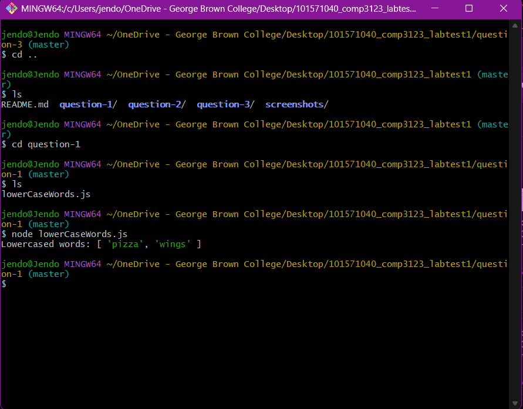
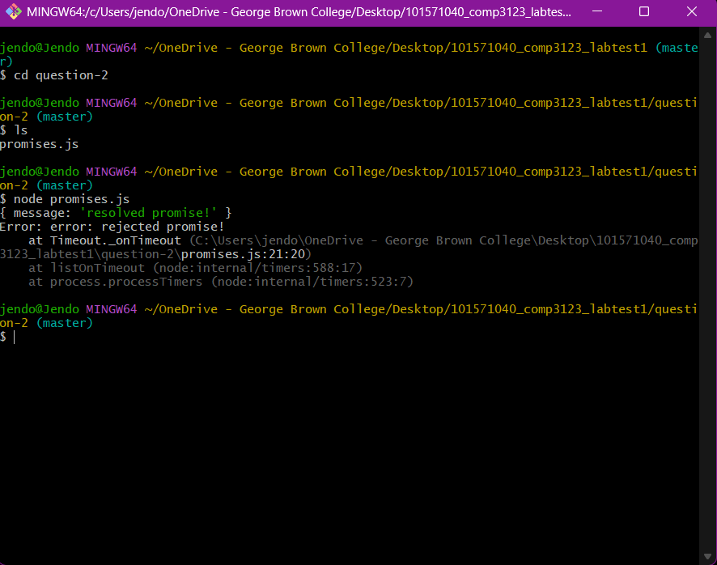
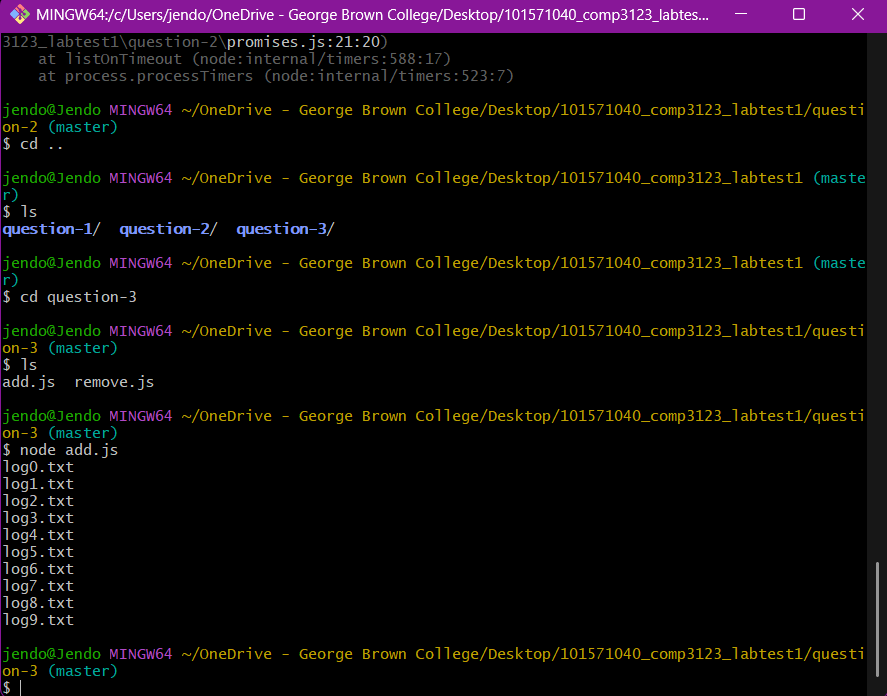
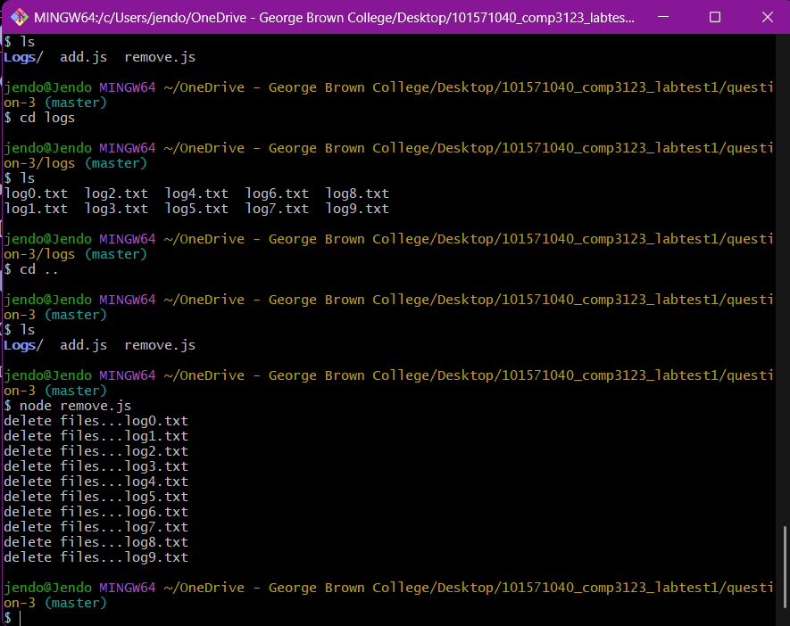

# COMP3123 – Lab Test 1

**Student:** Jenifa Joseph  
**Student ID:** 101571040

## Description

This contains solutions for Lab Test 1 using JavaScript ES6 and Node.js.

## Question 1 – ES6 Features

- Created a `lowerCaseWords()` function.
- Used a Promise to handle the result.
- Filtered non-string values from a mixed array.
- Converted the remaining strings to lowercase.

**File:** `question-1/lowerCaseWords.js`

### Output Screenshot



## Question 2 – Promises

- Created `resolvedPromise()` and `rejectedPromise()`.
- Used a 500ms timeout for both functions.
- Handled resolved and rejected results using `.then()` and `.catch()`.

**Files:** `question-2/callbacks.js`, `question-2/promises.js`

### Output Screenshot



## Question 3 – Node.js File System

- Used the `fs` and `path` modules.
- Created a `Logs` directory.
- Generated 10 log files (`log0.txt` to `log9.txt`).
- Deleted the log files and removed the directory.

**Files:** `question-3/add.js`, `question-3/remove.js`

### Create Log Files – Output Screenshot



### Remove Log Files – Output Screenshot



## How to Run

Run the following commands from the project root:

```bash
node question-1/lowerCaseWords.js
node question-2/promises.js
node question-3/add.js
node question-3/remove.js
```

## Technologies Used

- JavaScript (ES6)
- Node.js
- Node.js File System (`fs`)
- Node.js Path (`path`)